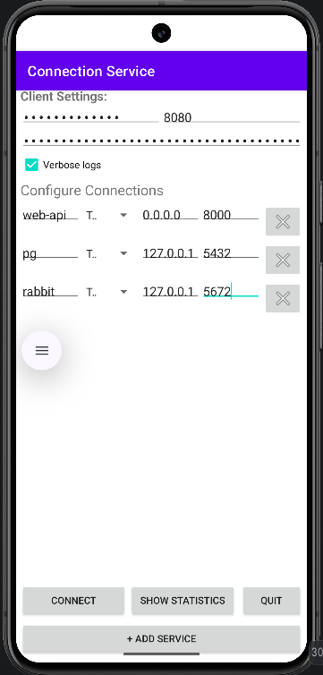

# Bizarredis Android Client

This project implements a lightweight client for Android devices to interact with the **Bizarredis** server application (for forwarding TCP and UDP traffic).

## Overview

The core logic is implemented in **Rust**, which compiles into native shared libraries (`.so` files) that are linked to an Android application. This approach allows running a fully functional server directly on the smartphone with all necessary configuration options enabled.

### Key Features

- **Native Performance**: The Rust backend ensures high performance and low latency.
- **Resource Optimization**: Unlike the main desktop/server project, this implementation is tuned specifically for mobile environments to minimize CPU and memory usage while maintaining functionality.
- **Kotlin UI Template**: A companion Kotlin application template (`android_ui_tpl`) is provided to easily configure settings and manage the server lifecycle via a user-friendly interface.

## Android UI Template

The `android_ui_tpl` directory contains a minimal, functional Android project written in Kotlin. It serves as a reference implementation for integrating the Rust library into an Android app.

> **Note**: This template includes only the essential files required to demonstrate integration and functionality. It is not a full-featured production app but provides a solid foundation for customization.

You can compile this template to produce an application similar to the one shown below:



## How to build so-files

First, ensure that the NDK is configured in Android Studio. Verify the `NDK_HOME` value in `.cargo/config.toml`. Then, run the following script to generate and copy the native libraries into your Android project:

```bash
./update_lib_files.sh ~/AndroidStudioProjects/<UI app project name>/
```
